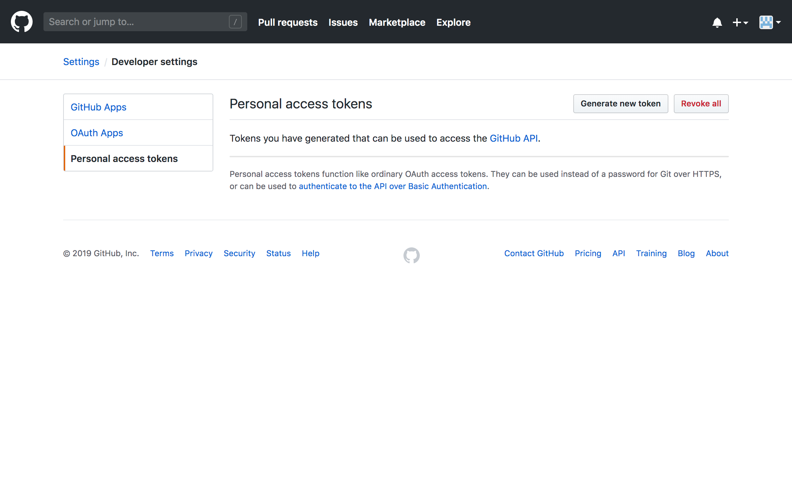
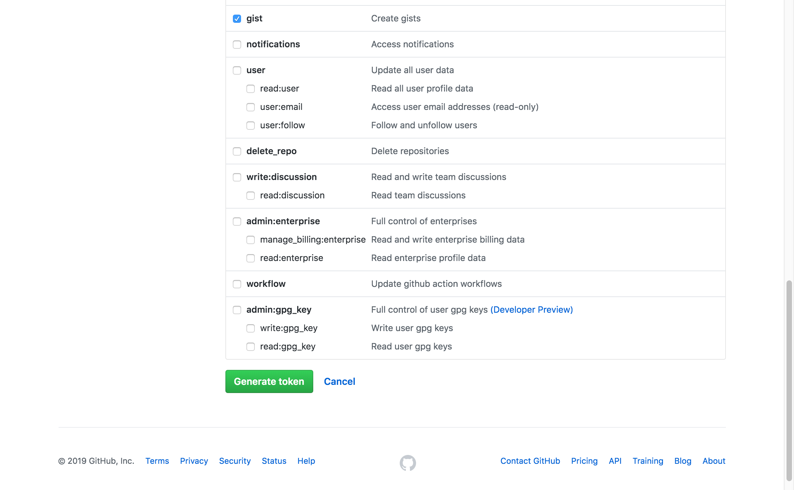
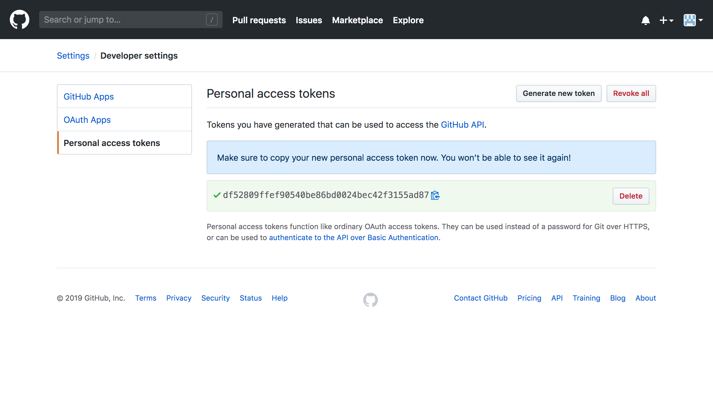

# DOTFiles

DOTFiles might be the most important files on your machine.

Synchronize your settings files over a github **Gist**

This directory contains a script, ```backup.py```, for backing up your DOTFiles

The script requires a GitHub token. It then uses the token to be retrived by your GitHub account while baCkup creates GIST if you are first time user.

## Installation

Install the required Python dependencies using ```pip3```:

```
$ pip3 install -r requirements.txt
```

## Configuring

### create a token

For authorization you need to create a new personal GitHub token.  To do this go to your Github account, then **Settings > Developer settings** and click **Personal access tokens**.



When you click the **Generate new token** button you enter the token creation screen. Here you should give the token a descriptive name and choose its *scopes*, which basically determine what the token is allowed to do.



You need to select only the Gist scope.



After clicking the **Generate token** button you're presented with the generated token. Remember to store it now, as GitHub won't show it to you anymore!

In the next example let's assume your token is ```df52809ffef90540be86bd0024bec42f3155ad87``` as in the above image.

### configuration file

create a ```~/.baCkupconfig.ini``` file based on the template as below, This file should contain the token we just created and the gist ID where we want to *restore* the files

```ini
[KEYS]
ACCESS_TOKEN = "" ; YOUR TOKEN goes here
GIST_ID = "" ; Gist ID ─── not required!
```

In the file named ```.config.ini``` stored at the root of your repository. add the files names to allow in the `[FILES_TO_SYNC]` section, one by line.

```ini
[FILES_TO_SYNC]
~/.bash_profile
~/.gitconfig
~/.gitignore
~/.inputrc
~/.vimrc
~/.zshrc
../cleaner.sh
~/Library/Application Support/Code/User/settings.json
```

## Running

After preparing the token and the configuration file you now can run the script

```
$ python3 backup.py --help
```
